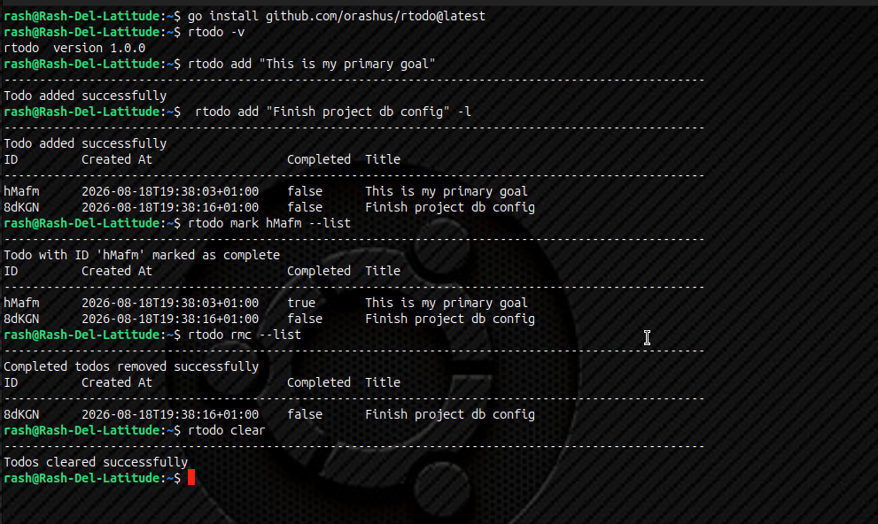

## Index

1. [rtodo](#rtodo)
2. [Install](#install)
3. [Storage](#storage)
4. [Todo shape](#todo-shape)
5. [Usage](#usage)
6. [Commands](#commands)
7. [Flags](#flags)
8. [Examples](#examples)
9. [Not implemented](#not-implemented-yet)

## rtodo

`rtodo` is a small command-line task tracker. It stores tasks as todos in a JSON file on disk in your `/tmp/` dir and prints them as a table.

The base code with the initial commits of this project live on my go-sandbox repo ([github.com/RashJrEdmund/go-sandbox](https://github.com/RashJrEdmund/go-sandbox)).
This project started out as a means of learning file handling.

```bash
rtodo <command> [input] [flags]
```

## Install

Requires Go. Install from the [main repository](https://github.com/orashus/rtodo). This puts `rtodo` on your `PATH` (`$GOPATH/bin` or `$HOME/go/bin`):

```bash
go install github.com/orashus/rtodo@latest
```

From this learning copy instead:

```bash
go install .
```

If you run it with no command:

```text
rtodo  version 1.0.0
Please provide a command
```


## Storage

Todos are loaded from and saved to `test-todos.json` in this directory.

If the file does not exist, the list is treated as empty. Saves write pretty-printed JSON (2-space indent). `clear` deletes the file.

The sample file currently has one todo. The examples below use it:


| ID      | Title           | Completed | Created at                            |
| ------- | --------------- | --------- | ------------------------------------- |
| `zAMzK` | Buy a new house | `false`   | `2026-08-18T16:34:53.480503493+01:00` |


## Todo shape

Each todo is a JSON object:

```json
{
  "id": "zAMzK",
  "title": "Buy a new house",
  "completed": false,
  "created_at": "2026-08-18T16:34:53.480503493+01:00"
}
```


| Field        | Type      | Notes                                                                                            |
| ------------ | --------- | ------------------------------------------------------------------------------------------------ |
| `id`         | string    | 5-character unique id (`a-zA-Z0-9_`)                                                             |
| `title`      | string    | The todo text you pass to `add`                                                                  |
| `completed`  | bool      | New todos start as `false`; `complete` / `done` / `finish` / `check` / `mark` set this to `true` |
| `created_at` | timestamp | Set to `time.Now()` when added                                                                   |


When printed, the table looks like:

```text
ID         Created At                   Completed  Title
---------------------------------------------------------------------------------------------------
zAMzK      2026-08-18T16:34:53+01:00    false      Buy a new house
```


## Usage

Command is the first argument. Input (title or id) is the second. Flags can appear anywhere in the remaining args, as `-short` or `--long`.

```bash
rtodo list
rtodo add "Buy a new house"
rtodo done zAMzK --print
rtodo rmc --print
rtodo rm zAMzK
rtodo list --completed
rtodo --version
```

IDs are generated automatically on `add`. Look them up with `list` (or in the JSON file) before `rm`, `complete`, and the other id-based commands.

## Commands


### `list`

Prints every todo in the store.

```bash
rtodo list
```

With `--completed` / `-c`, only completed todos are shown.

```bash
rtodo list --completed
```

With the sample file this is empty, because `zAMzK` has `"completed": false`.

### `add <title>`

Appends a new incomplete todo. Requires a title.

```bash
rtodo add "Buy a new house"
```

Success:

```text
---------------------------------------------------------------------------------------------------
Todo added successfully
```

If the title is missing:

```text
Please provide a title to add
```

Pass `--print` / `-p` or `--list` / `-l` to print the full list after adding.

### `complete` / `done` / `finish` / `check` / `mark` `<id>`

Marks that todo as complete (`completed: true`). All five command names do the same thing.

```bash
rtodo complete zAMzK
rtodo done zAMzK
rtodo finish zAMzK
rtodo check zAMzK
rtodo mark zAMzK
```

Success:

```text
---------------------------------------------------------------------------------------------------
Todo with ID 'zAMzK' marked as complete
```

If the id is missing:

```text
Please provide an ID to mark as complete
```

If the id is not in the store:

```text
---------------------------------------------------------------------------------------------------
Todo not found
```

Pass `--print` / `-p` or `--list` / `-l` to print the list afterwards. After `done zAMzK --print`:

```text
ID         Created At                   Completed  Title
---------------------------------------------------------------------------------------------------
zAMzK      2026-08-18T16:34:53+01:00    true       Buy a new house
```


### `rm` / `remove` / `delete` `<id>`

Removes the todo with that id. All three command names do the same thing.

```bash
rtodo rm zAMzK
rtodo remove zAMzK
rtodo delete zAMzK
```

Success:

```text
---------------------------------------------------------------------------------------------------
Todo with Id 'zAMzK' removed successfully
```

If the id is missing:

```text
Please provide an ID to remove
```

If the id is not in the store:

```text
---------------------------------------------------------------------------------------------------
Todo not found
```

Pass `--print` / `-p` or `--list` / `-l` to print the remaining list after removal.

### `rmc`

Removes every completed todo. Incomplete todos are left in place.

```bash
rtodo rmc
```

Success:

```text
---------------------------------------------------------------------------------------------------
Completed todos removed successfully
```

If `zAMzK` is still incomplete, `rmc` leaves it. After `done zAMzK` then `rmc --print`, the list is empty.

### `clear`

Deletes the todo file. If there is nothing to delete:

```text
---------------------------------------------------------------------------------------------------
No todos to clear
```

Otherwise:

```text
---------------------------------------------------------------------------------------------------
Todos cleared successfully
```

Pass `--print` / `-p` or `--list` / `-l` to print the (now empty) table afterwards.

### No command / `--version` / `-v`

`--version` / `-v` prints:

```text
rtodo  version 1.0.0
```

and exits without running a command.

An unknown command prints `Invalid command`. With `--print` / `--list` it still dumps the current list.

## Flags

Short and long forms are equivalent. Parsed flags are stripped before the command and input are read.


| Short | Long          | Effect                                                                                                  |
| ----- | ------------- | ------------------------------------------------------------------------------------------------------- |
| `-p`  | `--print`     | After `add`, `rm`, `rmc`, `clear`, or `complete`/`done`/`finish`/`check`/`mark`, print the current list |
| `-l`  | `--list`      | Same as `--print`                                                                                       |
| `-c`  | `--completed` | With `list`, show only completed todos                                                                  |
| `-v`  | `--version`   | Print `rtodo version 1.0.0` and exit                                                                    |
| `-h`  | `--help`      | Recognized, but no help text is printed yet                                                             |


## Examples

Using the sample todo from `test-todos.json`.

**List everything**

```bash
rtodo list
```

```text
ID         Created At                   Completed  Title
---------------------------------------------------------------------------------------------------
zAMzK      2026-08-18T16:34:53+01:00    false      Buy a new house
```

**Add another todo, then print**

```bash
rtodo add "Walk the dog" --print
```

**Mark "Buy a new house" complete**

```bash
rtodo done zAMzK --print
```

```text
---------------------------------------------------------------------------------------------------
Todo with ID 'zAMzK' marked as complete
ID         Created At                   Completed  Title
---------------------------------------------------------------------------------------------------
zAMzK      2026-08-18T16:34:53+01:00    true       Buy a new house
```

**List only completed todos**

```bash
rtodo list -c
```

After the `done` command above, that prints `zAMzK`. Before it, the list is empty.

**Remove completed todos**

```bash
rtodo rmc --print
```

That drops `zAMzK` once it is complete, and keeps any incomplete items.

**Remove by id**

```bash
rtodo rm zAMzK --print
```

**Wipe the list**

```bash
rtodo clear
```


## Not implemented (Yet)

The `update` command will require 2 inputs (id and new title).